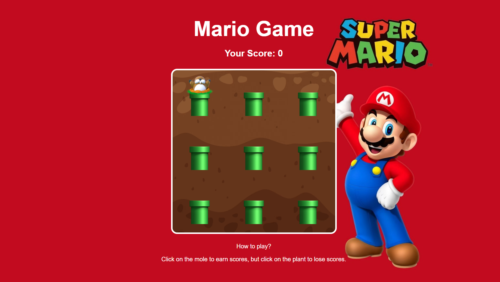

# Mario Game

A whack-a-mole inspired game, upgraded with creative rules and levels.
Built using **HTML, CSS, Vanilla JavaScript only**
Deployed at: [ Demo Link ](https://newmariogame.netlify.app/)

## Game Rules

- Click on the **mole** to earn +10 points 
- Click on the **plant** to lose -10 points 
- If your score goes below 0, you lose.
- You have 60 seconds to reach the target score.
- Bonus tiles randomly appear and grant extra score or time.

## Features

- 3x3 grid game board
- Countdown timer (60 seconds)
- Level system: harder as you score higher
- Penalties for mistakes
- Random bonus tiles for surprise

## Development Plan

| Date       | Feature                           |
|------------|-----------------------------------|
| Jul 10     | Plan & README setup               |
| Jul 11~13  | Timer                             |
| Jul 14~17  | Level system                      |
| Jul 18~21  | Penalty logic                     |
| Jul 22~24  | Bonus tile logic                  |
| Jul 25~26  | Final polish & deployment         |

## Screenshot

## Tech Stack

- HTML
- CSS
- JavaScript